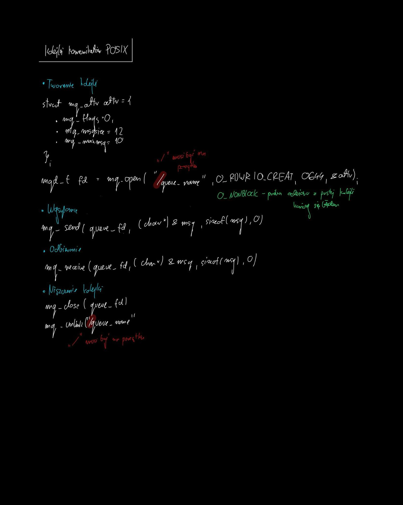
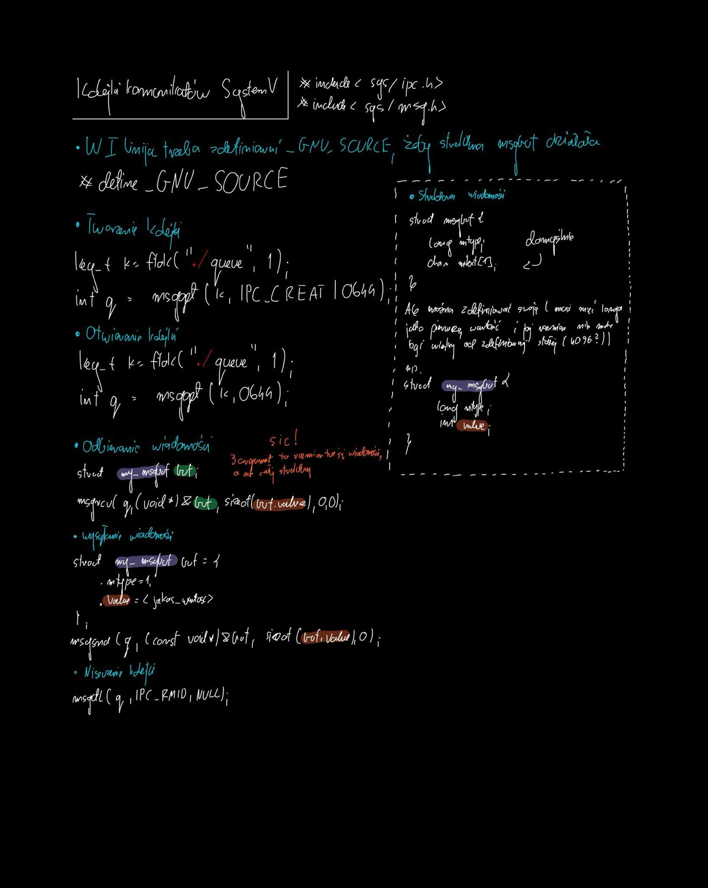
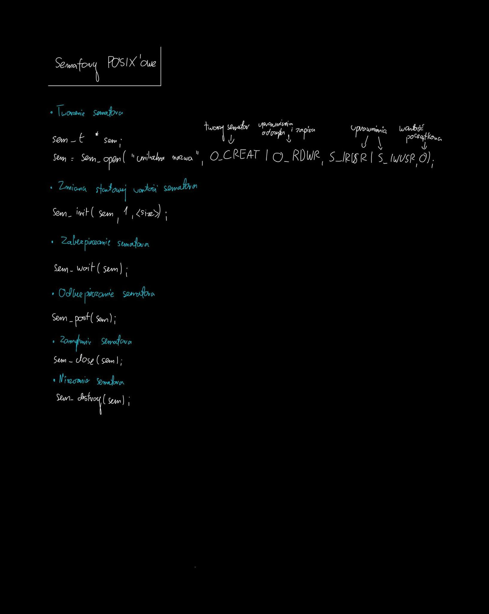
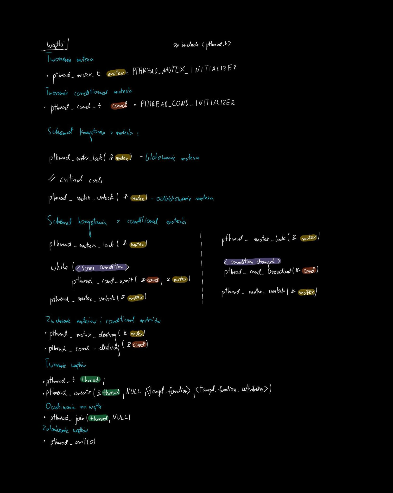
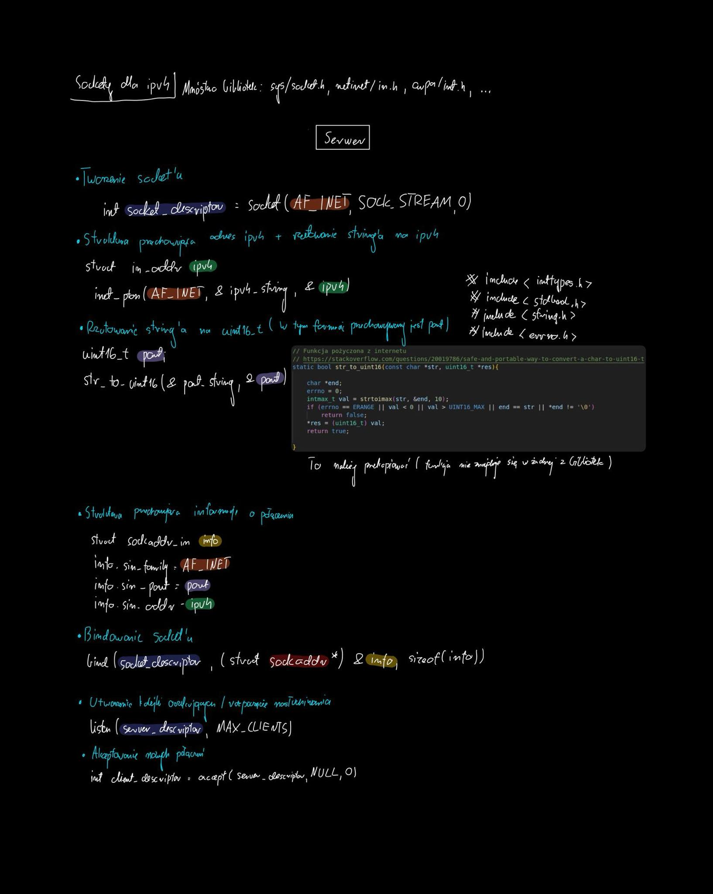
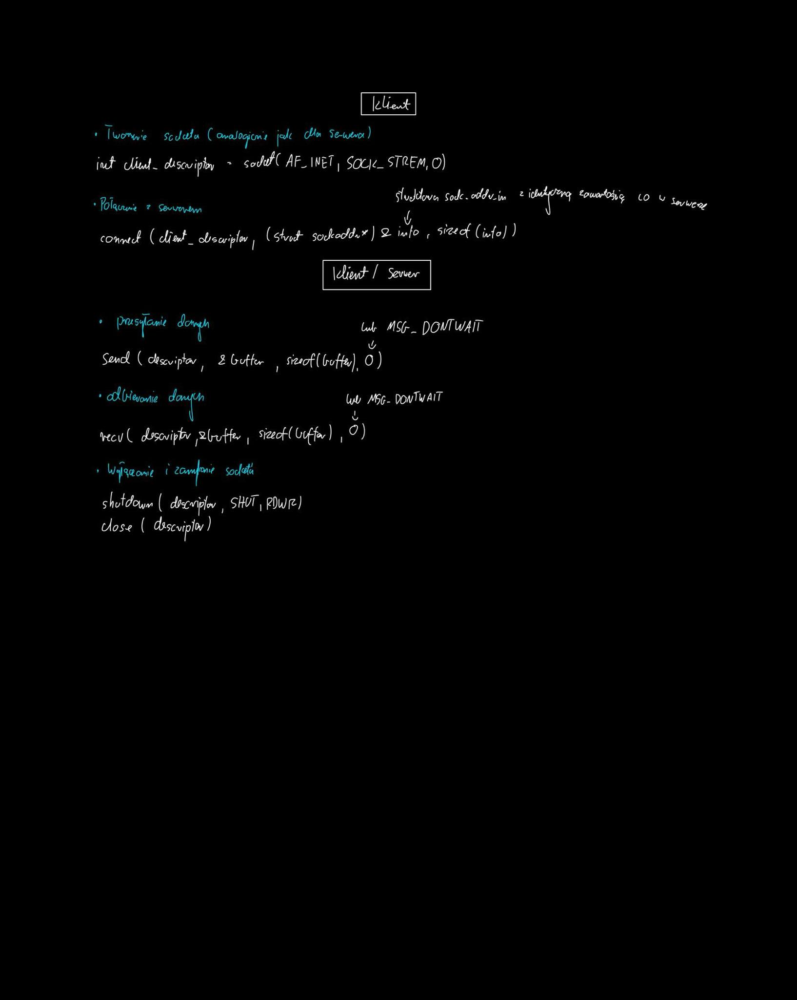
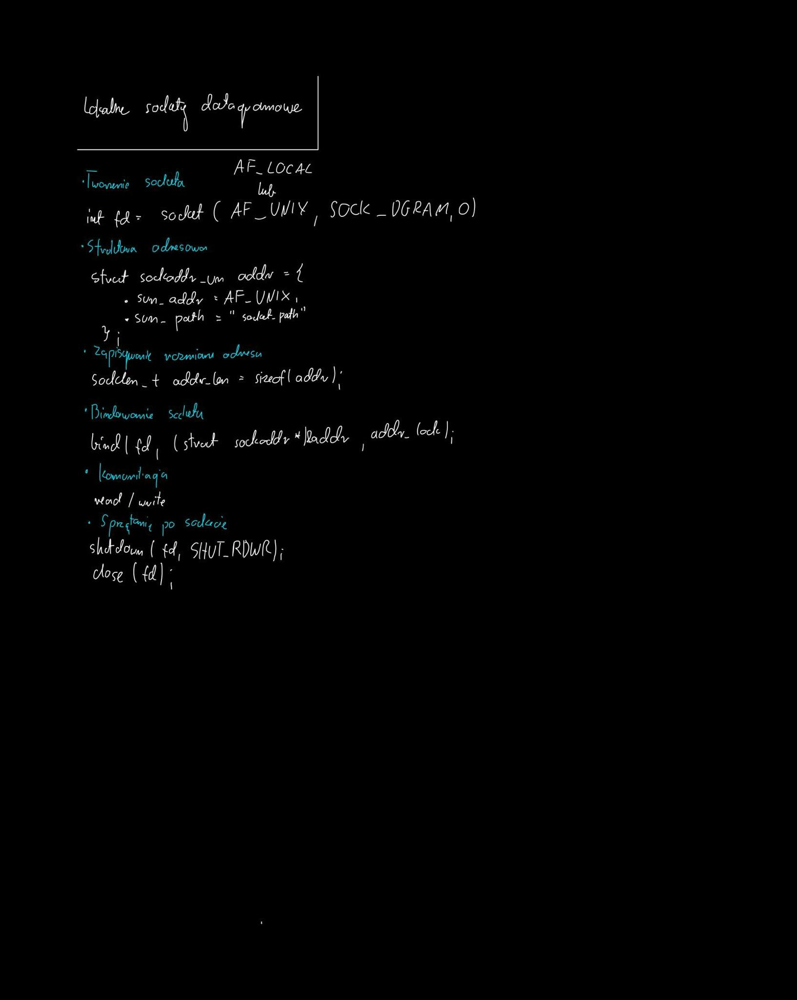

# SysOpy - Systemy Operacyjne

Repozytorium zawiera rozwiązania zadań z przedmiotu Systemy Operacyjne.

## Baza
[Przykładowe realizacje różnych zadań](./Baza)

## Laboratorium 1
[Makefile](./lab1)

## Laboratorium 2
[Biblioteki](./lab2)

## Laboratorium 3 
[Pliki lustrzane](./lab3)

## Laboratorium 4
[Procesy](./lab4)

## Laboratorium 5
[Sygnały](./lab5)

## Laboratorium 6
[Potoki](./lab6)

## Laboratorium 7
[Kolejki](./lab7)

## Kolejki POSIX

## Kolejki System V

## Laboratorium 8
[Semafory, pamięć wspólna](./lab8)

### Semafory POSIX

## Laboratorium 9 i Laboratorium 10
[Wątki](./lab9)
[Mutexy](./lab10)

## Laboratorium 11
[Sockety I](./lab11)

### Sockety przez IPv4 TCP

### Sockety lokalnie UDP

## Kolokwium 1 (4.5 / 5.0)
[Rozwiązania](./kolokwium1%20(4.5))

